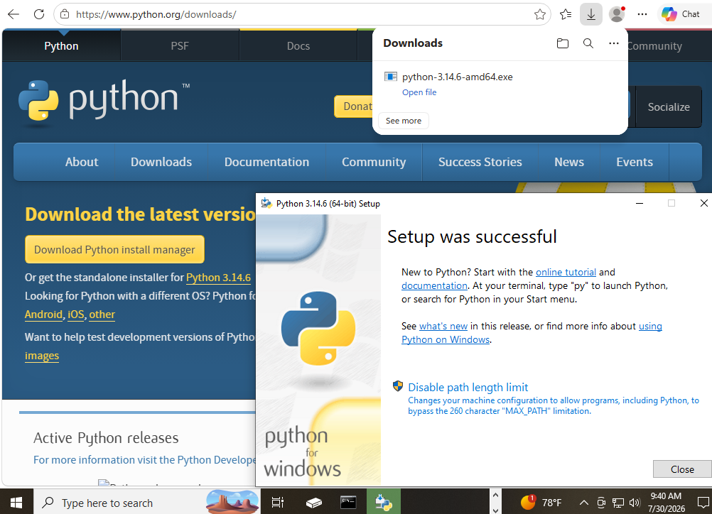
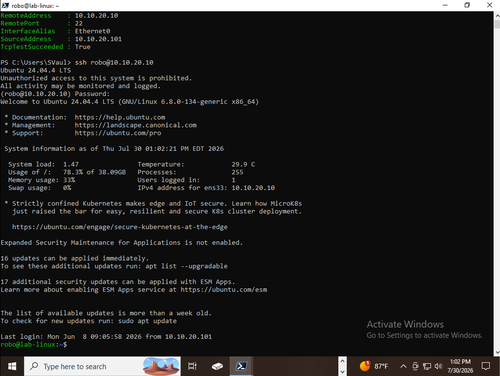

# Mission 4 – Complete the Foundation: From Building to Automating

## Objective

Prepare the cybersecurity lab for future automation by validating the management workstation, installing the tools required for automation, verifying administrative connectivity, and confirming that the environment is ready for the next phase of development.

---

## Technologies Used

- OpenSSH
- PowerShell 7
- Python 3
- Remote Desktop Protocol (RDP)
- VMware Workstation Pro
- Windows 10 Pro

---

## Environment

| Component | Configuration |
|-----------|---------------|
| Hypervisor | VMware Workstation Pro |
| Operating System | Windows 10 Pro |
| Network | Management Network |
| Primary Goal | Prepare the management workstation for automation and future security operations |

---

## Mission Overview

This mission completed the foundational build of the Hupfen Security Lab by preparing the management workstation for future automation and administrative workflows. Rather than introducing additional security technologies, the focus shifted toward validating the environment, installing development tools, and ensuring reliable connectivity between systems.

Python 3 and PowerShell 7 were installed to support future scripting and automation projects. Remote Desktop and SSH connectivity were verified to confirm secure administration of both Windows and Linux systems. Together, these steps establish a stable management platform capable of supporting future Missions involving security operations automation, workflow development, API integration, and repeatable administrative tasks.

---

## Security Concepts Demonstrated

- Environment Validation
- Secure Remote Administration
- Administrative Readiness
- Automation Preparation
- Operational Baseline Verification
- Infrastructure Validation
- Secure Management Workstation

---

## Objectives Completed

- Installed Python 3
- Installed PowerShell 7
- Verified Remote Desktop connectivity
- Verified SSH connectivity
- Validated management workstation readiness
- Completed the foundational cybersecurity lab build

---

## Skills Demonstrated

- Windows Administration
- PowerShell Administration
- Python Environment Configuration
- Remote System Administration
- SSH Administration
- Environment Validation
- Technical Documentation

---

## Validation

Validation included:

- Confirming successful Python installation
- Confirming successful PowerShell 7 installation
- Verifying Remote Desktop connectivity
- Verifying SSH connectivity to the Ubuntu Server
- Confirming the management workstation is ready for future automation

---

## Implementation

### Installing Python 3

Python 3 was installed to provide a flexible scripting platform for future automation projects. Many security tools, APIs, and workflow integrations rely on Python, making it an essential component of the management workstation.

---

### Installing PowerShell 7

PowerShell 7 was installed to provide a modern cross-platform automation framework capable of managing both Windows and Linux systems. Future Missions will use PowerShell to automate administrative tasks and security workflows.

---

### Verifying Remote Desktop Connectivity

Remote Desktop connectivity was validated to confirm reliable remote administration of Windows systems throughout the lab.

---

### Verifying SSH Connectivity

SSH connectivity to the Ubuntu Server was verified to ensure secure command-line administration and remote management of Linux systems.

---

## Lessons Learned

- A stable management workstation is essential before introducing automation
- Validation should occur before expanding a security environment
- Automation is most effective when built upon a well-tested foundation
- Preparing administrative tools in advance simplifies future security operations

---

## Next Mission

Completion of this mission prepares the lab for:

- Security Operations Automation
- Python scripting
- PowerShell automation
- API integrations
- Workflow automation
- Repeatable security operations

---

## Related Blog Article

**Mission 4 – Complete the Foundation: From Building to Automating**

[Read the article at Hupfen Dynamics](https://hupfendynamics.com/blog/f/mission-4---complete-the-foundation---from-building-to-automating)